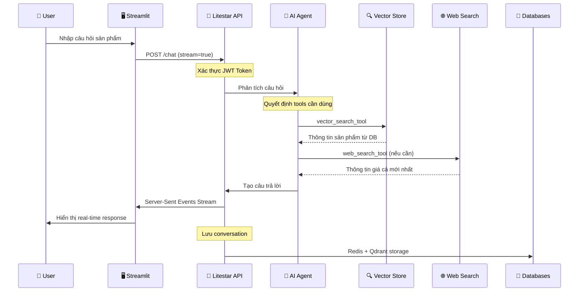
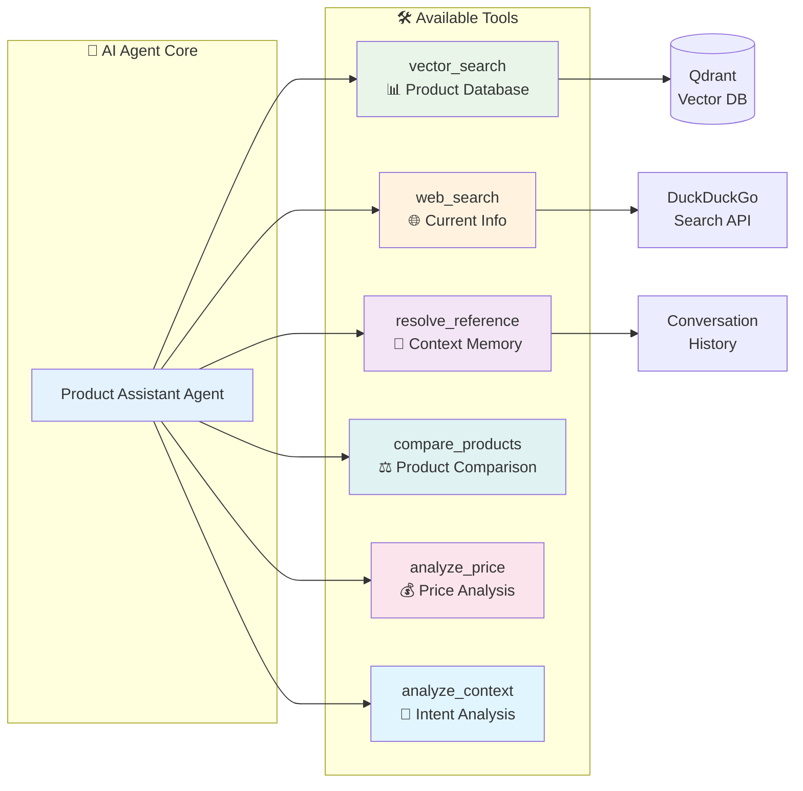
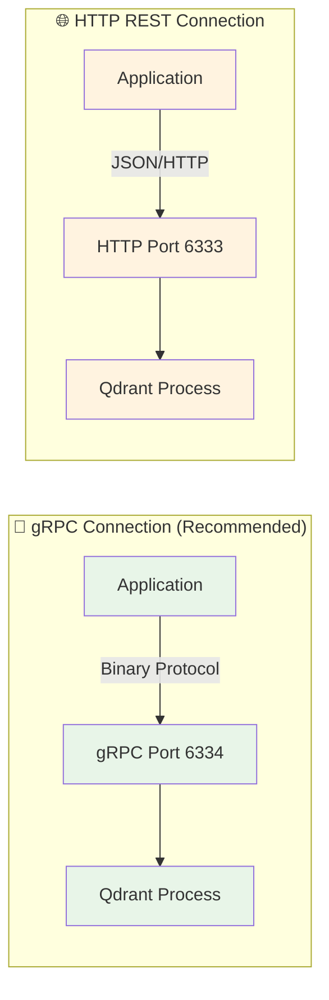
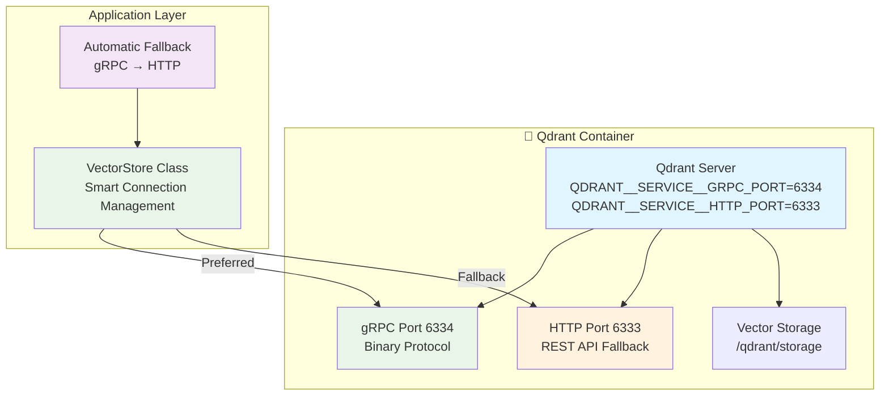

# 🤖 Hệ Thống Hỏi Đáp Sản Phẩm Điện Tử Thông Minh

Một hệ thống chatbot AI tiên tiến sử dụng LangChain Agent, Vector Search và Web Search để tư vấn sản phẩm điện tử một cách thông minh và chính xác.

## 📋 Giới Thiệu Tổng Quan

Hệ thống được xây dựng với kiến trúc hiện đại, tích hợp AI Agent thông minh có khả năng:

- 🧠 **AI Agent System**: Sử dụng 6 tools chuyên biệt để xử lý câu hỏi phức tạp
- 🔍 **Vector Search**: Tìm kiếm thông tin sản phẩm từ cơ sở dữ liệu Qdrant
- 🌐 **Web Search**: Tìm kiếm thông tin mới nhất trên internet
- 💬 **Streaming Response**: Phản hồi real-time với Server-Sent Events
- 🔐 **Authentication**: Bảo mật với JWT và Redis session
- 📊 **Performance Monitoring**: Theo dõi hiệu suất và debug chi tiết

## 🏗️ Kiến Trúc Hệ Thống

### Sơ Đồ Tổng Quan

```mermaid
graph TB
    subgraph "🖥️ Frontend Layer"
        ST[Streamlit UI<br/>Port: 8501]
        API_CLIENT[API Client<br/>aiohttp]
    end
    
    subgraph "🚀 Backend API Layer"
        LITESTAR[Litestar API Server<br/>Port: 8000]
        AUTH[Authentication Service<br/>JWT + BCrypt]
        CHAT[Chat Controller<br/>Streaming Support]
        CONV[Conversation Service<br/>Redis Storage]
    end
    
    subgraph "🤖 AI Processing Layer"
        AGENT[AI Agent System<br/>6 Intelligent Tools]
        PIPELINE[LangChain Pipeline<br/>Context Management]
        VECTOR[Vector Search<br/>Vietnamese Embedding]
        WEB[Web Search<br/>DuckDuckGo API]
    end
    
    subgraph "💾 Data Layer"
        QDRANT[(Qdrant Vector DB<br/>gRPC: 6334 (only protocol))]
        REDIS[(Redis Cache<br/>Unix Socket: /tmp/redis.sock)]
    end
    
    ST --> API_CLIENT
    API_CLIENT --> LITESTAR
    LITESTAR --> AUTH
    LITESTAR --> CHAT
    CHAT --> CONV
    CHAT --> AGENT
    AGENT --> PIPELINE
    PIPELINE --> VECTOR
    PIPELINE --> WEB
    VECTOR --> QDRANT
    CONV --> REDIS
    AUTH --> REDIS
    
    style AGENT fill:#e1f5fe
    style PIPELINE fill:#f3e5f5
    style VECTOR fill:#e8f5e8
    style WEB fill:#fff3e0
```

### Luồng Xử Lý Chat



### AI Agent Tools System



## ✨ Tính Năng Chính

### 🤖 AI Agent System
- **6 Tools Thông Minh**: Tự động chọn tool phù hợp cho từng câu hỏi
- **Context Awareness**: Hiểu ngữ cảnh cuộc trò chuyện, resolve tham chiếu
- **Tool Chaining**: Kết hợp nhiều tools để trả lời câu hỏi phức tạp
- **Performance Tracking**: Theo dõi hiệu suất và tối ưu hóa

### 🔍 Vector Search
- **Vietnamese Embedding**: AITeamVN/Vietnamese_Embedding model
- **Qdrant Integration**: High-performance vector database
- **Semantic Search**: Tìm kiếm theo ngữ nghĩa, không chỉ từ khóa
- **Chunking Strategy**: Chunk size 1000, overlap 200 tokens

### 🌐 Web Search
- **Real-time Information**: Thông tin giá cả, khuyến mãi mới nhất
- **Smart Decision**: AI quyết định khi nào cần web search
- **DuckDuckGo Integration**: Privacy-focused search engine
- **Regional Search**: Tìm kiếm tối ưu cho thị trường Việt Nam

### 💬 Streaming Response
- **Real-time Chat**: Server-Sent Events streaming
- **Progress Tracking**: Hiển thị tiến trình xử lý
- **Error Handling**: Xử lý lỗi graceful
- **Background Saving**: Lưu conversation không blocking

### 🔐 Security & Authentication
- **JWT Authentication**: Secure token-based auth
- **BCrypt Hashing**: Password encryption
- **Redis Sessions**: Distributed session management
- **Rate Limiting**: API protection
- **CORS Support**: Cross-origin resource sharing

### 📊 Conversation Management
- **Redis Storage**: Fast conversation retrieval
- **Pagination**: Efficient conversation listing
- **Auto-titling**: AI-generated conversation titles
- **History Search**: Find past conversations
- **Export/Import**: Conversation backup support

## 🚀 Cài Đặt và Chạy

### Yêu Cầu Hệ Thống
- Python 3.12+
- Docker & Docker Compose
- 4GB RAM minimum (8GB recommended)
- 10GB disk space

### 1. Clone Repository
```bash
git clone <repository-url>
cd DoAn
```

### 2. Cấu Hình Environment
```bash
cp .env.example .env
```

Chỉnh sửa file `.env`:
```env
# LLM Configuration
OPENAI_API_KEY=your_api_key_here
OPENAI_BASE_URL=https://api.x.ai/v1
LLM_MODEL_NAME=grok-3-mini

# Database Configuration
QDRANT_URL=localhost
QDRANT_PORT=6334                    # gRPC API port (only protocol supported)
REDIS_URL=unix:///tmp/redis.sock

# Embedding Model
EMBEDDING_MODEL_NAME=AITeamVN/Vietnamese_Embedding

# API Configuration
API_USER=admin
API_PASS=admin
JWT_SECRET=your_secret_here
```

> **Lưu ý Redis Configuration:**
> - Hệ thống sử dụng Redis qua Unix socket để tối ưu hiệu suất
> - Nếu cần fallback TCP: `REDIS_URL=redis://localhost:6379/`
> - Unix socket có latency thấp hơn và bảo mật tốt hơn TCP

### 3. Chạy với Docker Compose
```bash
# Khởi động databases
docker-compose up -d qdrant redis

# Cài đặt dependencies
pip install -e .

# Khởi tạo dữ liệu
python ingest.py
python init_admin_user.py
python init_conversation_collections.py
```

## 🔧 Qdrant gRPC Configuration chi tiết

### gRPC vs HTTP Performance



### Lợi ích gRPC
- **Hiệu suất cao hơn**: Binary protocol, nhanh hơn 30-50% so với HTTP
- **Bandwidth efficiency**: Ít dữ liệu truyền tải hơn
- **Type Safety**: Strongly typed với Protocol Buffers
- **Streaming Support**: Native support cho streaming operations
- **Connection Multiplexing**: Một connection cho multiple requests

### Docker Compose Qdrant Setup



### Connection Strategy
```python
# Automatic connection với fallback
if config.qdrant_use_grpc:
    try:
        # Thử gRPC trước (preferred)
        client = QdrantClient(
            url=url,
            port=grpc_port,
            grpc_port=grpc_port,
            prefer_grpc=True
        )
    except Exception:
        # Fallback sang HTTP nếu gRPC fail
        client = QdrantClient(url=url, port=http_port)
```

### Performance Benchmarking

```bash
# Benchmark gRPC connection
python -c "
from src.langchain_integration.vectorstore import VectorStore
import time

# Test gRPC performance
start = time.time()
vs = VectorStore(use_grpc=True)
vs.similarity_search('iPhone 15', k=10)
grpc_time = time.time() - start

print(f'gRPC search time: {grpc_time:.3f}s')
"

# Benchmark HTTP connection
python -c "
from src.langchain_integration.vectorstore import VectorStore
import time

# Test HTTP performance
start = time.time()
vs = VectorStore(use_grpc=False)
vs.similarity_search('iPhone 15', k=10)
http_time = time.time() - start

print(f'HTTP search time: {http_time:.3f}s')
"
```

### Qdrant Connection Troubleshooting

```bash
# Kiểm tra Qdrant container status
docker ps | grep qdrant

# Kiểm tra gRPC port accessibility
telnet localhost 6334

# Kiểm tra HTTP port accessibility  
curl http://localhost:6333/collections

# Xem Qdrant logs
docker-compose logs qdrant

# Test connection từ Python
python -c "
from src.langchain_integration.vectorstore import VectorStore
vs = VectorStore()
print('Connection info:', vs.get_connection_info())
"
```

### Configuration Options

```env
# gRPC Configuration (Recommended)
QDRANT_USE_GRPC=true
QDRANT_GRPC_PORT=6334

# HTTP Fallback
QDRANT_PORT=6333

# Connection timeout
QDRANT_TIMEOUT=10.0

# Debugging
QDRANT_DEBUG=false
```

### Common Issues & Solutions

#### ❌ gRPC connection failed
```bash
# Kiểm tra port binding
docker port <qdrant-container> 6334

# Restart Qdrant service
docker-compose restart qdrant

# Fallback sang HTTP temporarily
export QDRANT_USE_GRPC=false
```

#### ❌ Collection không tồn tại
```bash
# Tạo collection mới
python init_conversation_collections.py

# Kiểm tra collections
curl http://localhost:6333/collections
```

#### ❌ Embedding dimension mismatch
```bash
# Recreate collection với đúng vector size
python -c "
from src.langchain_integration.vectorstore import VectorStore
vs = VectorStore()
vs.create_collection(vector_size=768)  # Adjust size
"
```

### Development Tips

```bash
# Monitor gRPC connection health
python -c "
from src.langchain_integration.vectorstore import VectorStore
vs = VectorStore()
info = vs.get_connection_info()
print(f'Connected: {info[\"connected\"]}')
print(f'Protocol: {\"gRPC\" if info[\"use_grpc\"] else \"HTTP\"}')
print(f'Collections: {info[\"collections_count\"]}')
"

# Performance comparison
python -c "
import time
from src.langchain_integration.vectorstore import VectorStore

# Test both protocols
for use_grpc in [True, False]:
    vs = VectorStore(use_grpc=use_grpc)
    start = time.time()
    vs.similarity_search('test query', k=5)
    elapsed = time.time() - start
    protocol = 'gRPC' if use_grpc else 'HTTP'
    print(f'{protocol}: {elapsed:.3f}s')
"
```

## 🔧 Redis Configuration chi tiết

### Unix Socket vs TCP Performance

```mermaid
graph LR
    subgraph "🚀 Unix Socket (Recommended)"
        APP1[Application] -->|IPC| SOCKET[/tmp/redis.sock]
        SOCKET --> REDIS1[Redis Process]
    end
    
    subgraph "🌐 TCP Connection"  
        APP2[Application] -->|TCP/IP| PORT[localhost:6379]
        PORT --> REDIS2[Redis Process]
    end
    
    style APP1 fill:#e8f5e8
    style SOCKET fill:#e8f5e8
    style REDIS1 fill:#e8f5e8
    style APP2 fill:#fff3e0
    style PORT fill:#fff3e0
    style REDIS2 fill:#fff3e0
```

### Docker Compose Redis Setup

```mermaid
graph TB
    subgraph "🐳 Docker Services"
        subgraph "Redis Container"
            REDIS_SERVICE[Redis Server<br/>--unixsocket /tmp/redis.sock<br/>--unixsocketperm 755]
            REDIS_SOCKET[/tmp/redis.sock]
            REDIS_PORT[Port 6379<br/>TCP Fallback]
        end
        
        subgraph "Application Container"
            APP[Application<br/>REDIS_URL=unix:///tmp/redis.sock]
        end
        
        subgraph "Shared Volumes"
            SOCKET_VOLUME[redis_socket:/tmp]
            DATA_VOLUME[redis_data:/data]
        end
    end
    
    REDIS_SERVICE --> REDIS_SOCKET
    REDIS_SERVICE --> REDIS_PORT
    REDIS_SOCKET --> SOCKET_VOLUME
    SOCKET_VOLUME --> APP
    DATA_VOLUME --> REDIS_SERVICE
    
    style REDIS_SERVICE fill:#e1f5fe
    style REDIS_SOCKET fill:#e8f5e8
    style APP fill:#e8f5e8
    style SOCKET_VOLUME fill:#f3e5f5
```

### Lợi ích Unix Socket
- **Hiệu suất cao hơn**: Không cần network stack overhead
- **Latency thấp hơn**: Direct Inter-Process Communication (IPC)
- **Bảo mật tốt hơn**: Chỉ accessible từ local machine
- **Resource efficiency**: Ít CPU và memory overhead

### Connection Strings
```env
# Recommended: Unix Socket
REDIS_URL=unix:///tmp/redis.sock

# Fallback: TCP (cho development/testing)
REDIS_URL=redis://localhost:6379/

# Với database index
REDIS_URL=unix:///tmp/redis.sock?db=0

# Với password (nếu cần)
REDIS_URL=unix://:password@/tmp/redis.sock
```

## 🛠️ Redis Troubleshooting

### Kiểm tra Redis Connection

```bash
# Kiểm tra Redis container đang chạy
docker ps | grep redis

# Kiểm tra Redis socket file
docker exec redis-container ls -la /tmp/redis.sock

# Test connection với redis-cli
docker exec redis-container redis-cli -s /tmp/redis.sock ping

# Test từ application
python -c "
import redis
r = redis.from_url('unix:///tmp/redis.sock')
print('Redis connection:', r.ping())
"
```

### Common Issues & Solutions

#### ❌ Socket file không tồn tại
```bash
# Kiểm tra volume mount
docker volume inspect <project>_redis_socket

# Khởi động lại Redis container
docker-compose restart redis
```

#### ❌ Permission denied
```bash
# Kiểm tra socket permissions
docker exec redis-container ls -la /tmp/redis.sock

# Nếu cần, adjust permissions
docker exec redis-container chmod 755 /tmp/redis.sock
```

#### ❌ Connection refused
```bash
# Kiểm tra Redis process
docker exec redis-container ps aux | grep redis

# Kiểm tra Redis logs
docker-compose logs redis

# Fallback sang TCP
export REDIS_URL="redis://localhost:6379/"
```

### Development Tips

```bash
# Chạy Redis cli trong container
docker exec -it redis-container redis-cli -s /tmp/redis.sock

# Monitor Redis commands
docker exec redis-container redis-cli -s /tmp/redis.sock monitor

# Kiểm tra Redis info
docker exec redis-container redis-cli -s /tmp/redis.sock info

# Backup/restore qua Unix socket
docker exec redis-container redis-cli -s /tmp/redis.sock --rdb /tmp/dump.rdb
```

### Performance Benchmarking

```bash
# Benchmark Unix socket
docker exec redis-container redis-cli -s /tmp/redis.sock --latency-history

# So sánh với TCP
docker exec redis-container redis-cli -h localhost -p 6379 --latency-history

# Throughput test
docker exec redis-container redis-cli -s /tmp/redis.sock eval "
for i=1,10000 do 
  redis.call('set', 'bench:' .. i, 'value' .. i) 
end
" 0
```

### 4. Khởi Động Services

**Backend API:**
```bash
litestar run
# Hoặc: python -m litestar run
# API server: http://localhost:8000
```

**Frontend UI:**
```bash
streamlit run src/streamlit/app.py
# UI: http://localhost:8501
```

### 5. Development Mode
```bash
# Install development dependencies
pip install -e ".[dev]"

# Run with auto-reload
litestar run --reload

# Run tests
pytest

# Code formatting
ruff format .
ruff check .
```

## 📚 API Documentation

### Authentication
```bash
# Login
curl -X POST http://localhost:8000/auth/login \
  -H "Content-Type: application/json" \
  -d '{"username": "admin", "password": "admin"}'

# Register
curl -X POST http://localhost:8000/auth/register \
  -H "Content-Type: application/json" \
  -d '{"username": "newuser", "password": "password123"}'
```

### Chat Endpoints
```bash
# Non-streaming chat
curl -X POST http://localhost:8000/chat/ \
  -H "Authorization: Bearer <token>" \
  -H "Content-Type: application/json" \
  -d '{"message": "Tư vấn laptop gaming tầm giá 20 triệu", "stream": false}'

# Streaming chat
curl -X POST http://localhost:8000/chat/ \
  -H "Authorization: Bearer <token>" \
  -H "Content-Type: application/json" \
  -d '{"message": "So sánh iPhone 15 vs Samsung S24", "stream": true}'
```

### Conversation Management
```bash
# List conversations
curl -X GET http://localhost:8000/chat/conversations \
  -H "Authorization: Bearer <token>"

# Get conversation history
curl -X GET http://localhost:8000/chat/conversations/<conversation_id> \
  -H "Authorization: Bearer <token>"
```

### Monitoring Endpoints
```bash
# Agent statistics
curl -X GET http://localhost:8000/chat/agent-stats \
  -H "Authorization: Bearer <token>"

# Search debug info
curl -X GET "http://localhost:8000/chat/search-info?query=iPhone 15" \
  -H "Authorization: Bearer <token>"

# Health check
curl -X GET http://localhost:8000/health
```

### Streaming Format
Server-Sent Events format:
```
data: {"type": "start", "conversation_id": "uuid", "content": ""}

data: {"type": "chunk", "content": "Xin chào! Tôi có thể", "conversation_id": "uuid"}

data: {"type": "chunk", "content": " giúp bạn tư vấn", "conversation_id": "uuid"}

data: {"type": "end", "content": "", "metadata": {"total_length": 150}}
```

## 📁 Cấu Trúc Dự Án

```
DoAn/
├── 🚀 app.py                          # Main Litestar application
├── 📋 pyproject.toml                  # Python project configuration
├── 🐳 compose.yaml                    # Docker Compose services
├── 🔧 *.py                           # Utility scripts (ingest, init, etc.)
│
├── 📂 src/                           # Source code chính
│   ├── 🔧 config/                    # Configuration management
│   │   └── config.py                 # Settings và environment variables
│   │
│   ├── 🌐 api/                       # REST API layer
│   │   ├── 🔐 auth/                  # Authentication services
│   │   ├── 🛡️ middleware/            # API middleware (CORS, logging, rate limit)
│   │   ├── 🛣️ routes/                # API endpoints
│   │   │   ├── auth.py               # Auth routes
│   │   │   ├── chat.py               # Chat routes (main functionality)
│   │   │   └── health.py             # Health check
│   │   ├── 📋 schemas/               # Pydantic models
│   │   └── 🔧 services/              # Business logic services
│   │
│   ├── 🤖 langchain_integration/     # AI & LangChain components
│   │   ├── agent_system.py           # 🧠 AI Agent với 6 tools
│   │   ├── pipeline.py               # 🔄 LangChain processing pipeline
│   │   ├── vectorstore.py            # 🔍 Qdrant vector database
│   │   ├── web_search.py             # 🌐 DuckDuckGo web search
│   │   ├── llm_search_system.py      # 🎯 LLM decision system
│   │   ├── llm_search_agent.py       # 🤖 LLM search agent
│   │   ├── product_introduction_agent.py # 📱 Product intro agent
│   │   └── text_processor.py         # 📝 Text processing utilities
│   │
│   └── 🖥️ streamlit/                 # Frontend UI
│       ├── app.py                    # Main Streamlit application
│       └── README.md                 # Streamlit-specific docs
│
├── 📚 docs/                          # Documentation
│   ├── 🏗️ arch.mmd                  # Architecture diagrams
│   ├── 📖 *.md                       # Various documentation files
│   └── 📊 *.mmd                      # Mermaid diagrams
│
└── 📓 notebooks/                     # Jupyter notebooks cho development
    └── qdrant_import_export.ipynb    # Database utilities
```

### Key Components

- **🤖 Agent System**: Trái tim của hệ thống, xử lý logic AI
- **🔍 Vector Store**: Tìm kiếm semantic với Qdrant
- **🌐 Web Search**: Thông tin real-time từ internet
- **💬 Chat Pipeline**: Xử lý conversation và streaming
- **🔐 Auth System**: Bảo mật và quản lý user
- **🖥️ Streamlit UI**: Giao diện user-friendly

## 📊 Monitoring và Debug

### Agent Performance Statistics
```bash
# Xem thống kê agent
GET /chat/agent-stats
```

Response:
```json
{
  "agent_enabled": true,
  "system_stats": {
    "performance": {
      "total_queries": 150,
      "tool_calls": 287,
      "successful_resolutions": 148,
      "average_tools_per_query": 1.91
    },
    "available_tools": ["vector_search", "web_search", "resolve_conversation_reference", ...]
  }
}
```

### Search Debug Information
```bash
# Debug search decisions
GET /chat/search-info?query=iPhone 15 Pro Max
```

Response:
```json
{
  "vector_results_count": 5,
  "vector_results": [...],
  "web_search_enabled": true,
  "would_use_web_search": true,
  "web_results_count": 3,
  "web_results": [...],
  "agent_reasoning": ["Step 1: Used vector_search", "Step 2: Used web_search"]
}
```

### Performance Metrics
- **Tool Usage**: Theo dõi frequency mỗi tool được sử dụng
- **Response Time**: Average processing time cho mỗi query
- **Cache Hit Rate**: Tỷ lệ cache hit của decision system
- **Error Rate**: Tracking lỗi và failure cases

### System Optimization
```bash
# Reset agent statistics
POST /chat/agent-reset

# Optimize system performance
# (Automatically clears cache, resets counters)
```

### Logging & Monitoring
- **Structured Logging**: Sử dụng structlog cho consistent logging
- **Request Tracing**: Track mỗi request từ đầu đến cuối
- **Performance Profiling**: Monitor database query times
- **Health Checks**: Automated service health monitoring

---

## 👥 Tác Giả

**Lâm Quang Trí**
- Email: quangtri.lam.9@gmail.com
- GitHub: [Profile]

## 📄 License

MIT License - xem file [LICENSE](LICENSE) để biết thêm chi tiết.

---

## 🎯 Roadmap

- [ ] 🌍 Multi-language support
- [ ] 📱 Mobile app development
- [ ] 🔊 Voice interaction
- [ ] 📈 Advanced analytics dashboard
- [ ] 🤖 More specialized agents
- [ ] 🔗 Third-party integrations

---

*Hệ thống được phát triển với ❤️ sử dụng Python, LangChain, và các công nghệ AI hiện đại*
